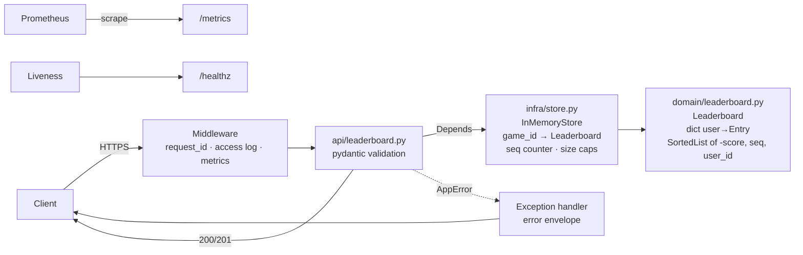

# Leaderboard Service — Design

## 1. Problem
A REST API that ranks users by score **per game** in real time. Clients submit a
score for a user in a game; readers fetch the top N or a user's rank with the
users immediately above and below. Must be correct under concurrent writes,
validate all input, and be deployable, observable, and tested.

**Hardest thing:** one ordering that is indexable by position (rank) and by key
(user), stays consistent under concurrent writes, and breaks ties
deterministically.

## 2. Locked ranking rules

These rules are authoritative. Tests and Swagger smoke checks must match them.

1. **A score update replaces that user's score for that game.** A different
   value (higher *or* lower) overwrites the stored score. An **equal** resubmit
   is a no-op (score, rank, and tie-break stay unchanged).
2. **A higher score ranks better. Rank 1 is the best score.** Ranks are
   1-indexed unique ordinals (1, 2, 3…).
3. **Equal scores are ties.** Break ties in a fixed order:
   - earlier achievement first (`achieved_seq`, server monotonic counter),
   - then `user_id` ascending.
   Never use client time. The same rule applies to Top X and surroundings.
4. **Each game has its own leaderboard.** Scores never cross `game_id`.
5. **Surroundings** (default `window=1`) means: this user, the one user
   immediately above, and the one user immediately below. Rank 1 has empty
   `above`; last has empty `below`.

**Scores:** strict integers in `[score_min, score_max]` (negatives allowed;
floats / `"100"` / bools rejected). **IDs:** `^[A-Za-z0-9_-]{1,id_max_len}$`.

**Empty / unknown game on Top X:** HTTP 200 with `total=0` and `entries=[]`
(not an error). **Unknown game or user on surroundings:** 404
`game_not_found` / `user_not_found`.

## 3. Assumptions

| Area | Assumption |
|---|---|
| Scale | ≤ 1M entries per game in memory, single instance |
| Semantics | Latest different score wins; equal resubmit is a no-op |
| Tie-break | Earlier `achieved_seq`, then `user_id` |
| Auth | Optional static `API_KEY` on writes; reads public |
| Durability | In-memory; restart loses data |
| Tenancy | `game_id` partitions boards |

## 4. Architecture

| Layer | Module | Rule |
|---|---|---|
| API | `app/api/` | HTTP only; pydantic in, JSON out |
| Infra | `app/infra/store.py` | Lifetime, caps, sequence counter |
| Domain | `app/domain/leaderboard.py` | Pure; stdlib + `sortedcontainers` |

Dependencies point inward. No `LeaderboardStore` Protocol until a second store
(e.g. Redis) exists.

## 5. Data model (per game)

- `by_user: dict[str, Entry]` — O(1) lookup of the user's current key.
- `ranked: SortedList[(-score, achieved_seq, user_id)]` — ordered view.

| Operation | Implementation | Cost |
|---|---|---|
| submit | if score ≠ old: remove old key, add new; if equal: no-op | O(log n) |
| top(limit, offset) | slice ranked; missing game → empty | O(log n + limit) |
| rank_of(user) | `ranked.index(key) + 1` | O(log n) |
| around(user, k) | slices `[i−k, i)` and `(i, i+k]`, clamped | O(log n + k) |

**Invariant:** `len(by_user) == len(ranked)` and each user appears once. Update
order: compute new key → remove old → add new (nothing that can raise between).

## 6. API

| Method | Path | Success | Errors |
|---|---|---|---|
| POST | `/v1/games/{game_id}/scores` | 201 + `Location` (first entry) / 200 `{game_id,user_id,score,rank,improved}` | 400, 409 |
| GET | `/v1/games/{game_id}/leaderboard?limit&offset` | 200 `{game_id,total,entries}` (empty OK) | 400 |
| GET | `/v1/games/{game_id}/users/{user_id}?window` | 200 `{rank,score,total,above,below}` | 400, 404 |
| GET | `/healthz` · `/readyz` · `/metrics` · `/docs` | 200 | — |

Error envelope: `{"error": {"code", "message", "details", "request_id"}}`.
Failed validation / capacity checks leave the board unchanged.

`improved` is `true` only when the new score is **strictly greater** than the
previous; a lower replacement still updates the board with `improved: false`.

## 7. Concurrency

Store mutations are synchronous (no `await`). One uvicorn worker. Concurrent
asyncio tasks serialize on the event loop, so each read-modify-write is atomic.
If an `await` or thread pool is added later, use a per-game `asyncio.Lock` and
never hold it across network I/O.

## 8. Bounds (config only)

| Resource | Setting | Default policy |
|---|---|---|
| Score range | `score_min` … `score_max` | −1e9 … 1e9; integers only |
| ID length / charset | `id_max_len`, `[A-Za-z0-9_-]` | reject spaces / empty / too long |
| Page size | `top_default` / `top_max` | default 10, max 100; over max → 400 |
| Surroundings | `window_default` / `window_max` | default 1, max 25 |
| Games / users | `max_games`, `max_users_per_game` | 409 when full |
| Metric labels | outcome enum only | never `game_id` / `user_id` |

## 9. Failure modes

| Failure | Behaviour |
|---|---|
| Process restart | Data lost; `/healthz` recovers |
| Capacity reached | 409 `capacity_exceeded`; existing users can still update |
| Malformed input | 400 `validation_failed`; board unchanged |
| Unhandled bug | 500 `internal_error`, logged with `request_id` |

## 10. Where it breaks first

1. **Memory** — one process holds every board.
2. **Horizontal scale** — a second instance has its own state → Redis ZSET.
3. **Hot game** — one event loop serialises writes → shard by `game_id`.

## 11. Deliberately deferred

| Feature | Why | How later |
|---|---|---|
| Redis / multi-instance | P0 proves ranking in-process | ZSET + composite score for ties |
| Daily/weekly boards | Scope | Key per `(game, period)` |
| Live rank push | Scope | SSE from submit results |
| Rate limiting | Scope | Token bucket, 429 + Retry-After |
| Anti-cheat | Product | Signed tokens from game server |

## 12. Decision log (ADRs)

See [DECISIONS.md](DECISIONS.md):

| ADR | Decision |
|---|---|
| 001 | Replace on different score; equal resubmit is a no-op |
| 002 | Tie-break `(-score, achieved_seq, user_id)` |
| 003 | In-memory `SortedList` + dict |
| 004 | Single event-loop, one uvicorn worker |
| 005 | Unknown game on Top X → empty board; surroundings → 404 |

## 13. Verification

- Automated suite: cases 1–53 in `tests/test_checklist_cases.py` (+ domain /
  concurrency modules). Check status **and** body.
- Manual smoke via Swagger `/docs`: cases 1, 4, 17, 24, 25, 34.
- Swagger does **not** replace the automated table.
