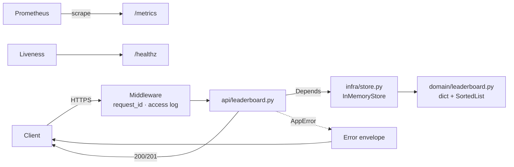

# Architecture

See also [DESIGN.md](../DESIGN.md) and [DECISIONS.md](../DECISIONS.md).

## Layers
| Layer | Module | Rule |
|---|---|---|
| API | `app/api/` | HTTP only; pydantic in, JSON out |
| Infra | `app/infra/store.py` | Lifetime, caps, sequence counter |
| Domain | `app/domain/leaderboard.py` | Pure; stdlib + sortedcontainers |

## Process model
One uvicorn worker. State lives on `app.state.store`. Multiple workers would
split the board (each process has its own memory).
