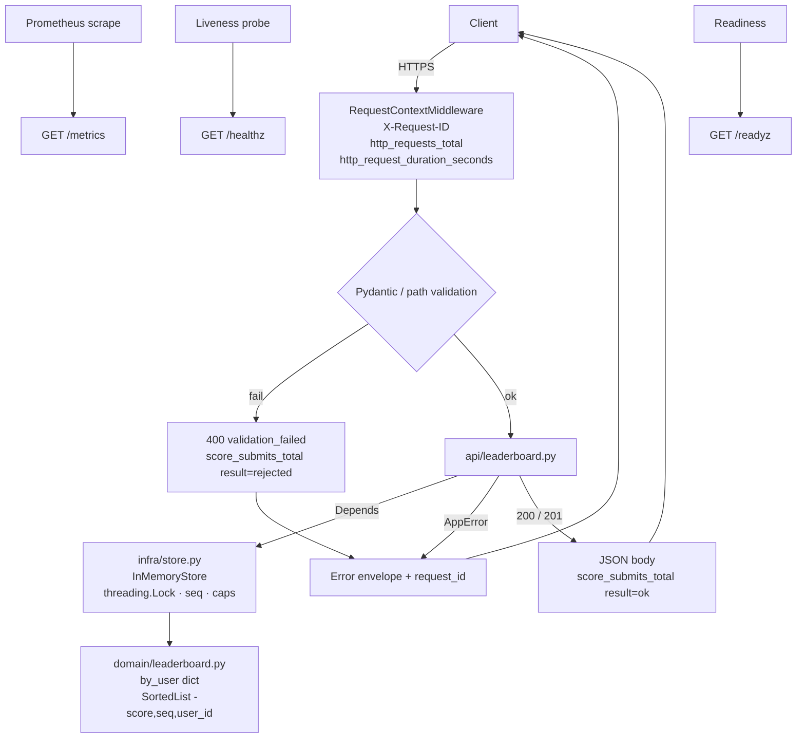

# Architecture

**Design:** [DESIGN.md](../DESIGN.md) · **ADRs:** [DECISIONS.md](../DECISIONS.md) ·
**Spec:** [SPEC.md](../SPEC.md) · **Architecture:** this file

## Request lifecycle (anchor for review)

**Label rule:** HTTP metrics use the **route template**
(`/v1/games/{game_id}/scores`), never raw `game_id` / `user_id`.

## Layers
| Layer | Module | Rule |
|---|---|---|
| API | `app/api/` | HTTP only; pydantic in, JSON out |
| Infra | `app/infra/store.py` | Lifetime, caps, sequence counter; `global_top` aggregates on read |
| Domain | `app/domain/leaderboard.py` | Pure; stdlib + sortedcontainers |

**Global board** (`GET /v1/leaderboard`): sum of each user's per-game scores;
tie-break `min(achieved_seq)`, then `user_id`; entries include `games_played`.
Also: `GET /v1/users/{id}` (profile), `GET /v1/games` (list),
`GET /v1/games/{id}/compare`. All recompute from existing boards — no extra
SortedList.

## Process model
One uvicorn worker. Sync routes run on a threadpool; `InMemoryStore` uses one
`threading.Lock` for every read/write. State lives on `app.state.store`. Multiple
workers would split the board (each process has its own memory). Restart clears
all boards (in-memory; documented).

Caps (from `Settings` only): `max_games=100`, `max_users_per_game=10_000`
(≤ 1M entries total on a basic-xxs-sized process).

## Observability (only these series)
| Metric | Labels |
|---|---|
| `http_requests_total` | `method`, `route`, `status` |
| `http_request_duration_seconds` | `method`, `route`, `status` |
| `score_submits_total` | `result` ∈ {`ok`, `rejected`} |
